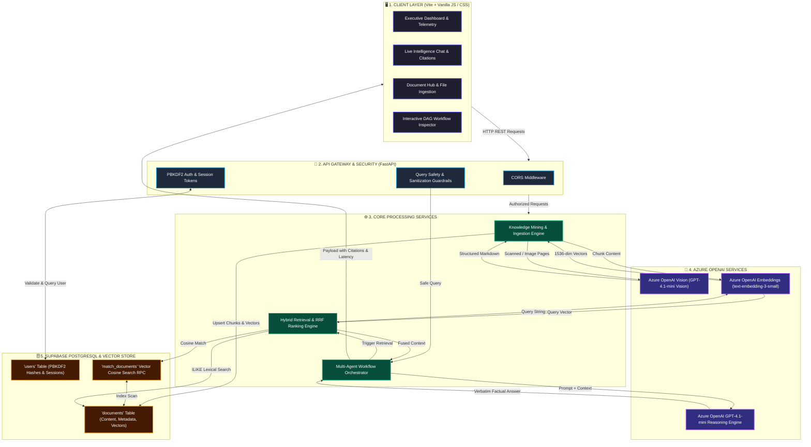
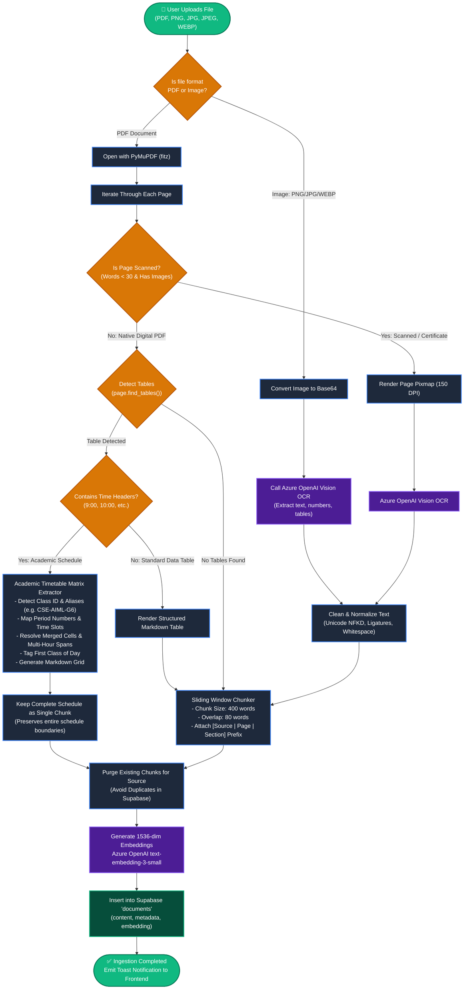
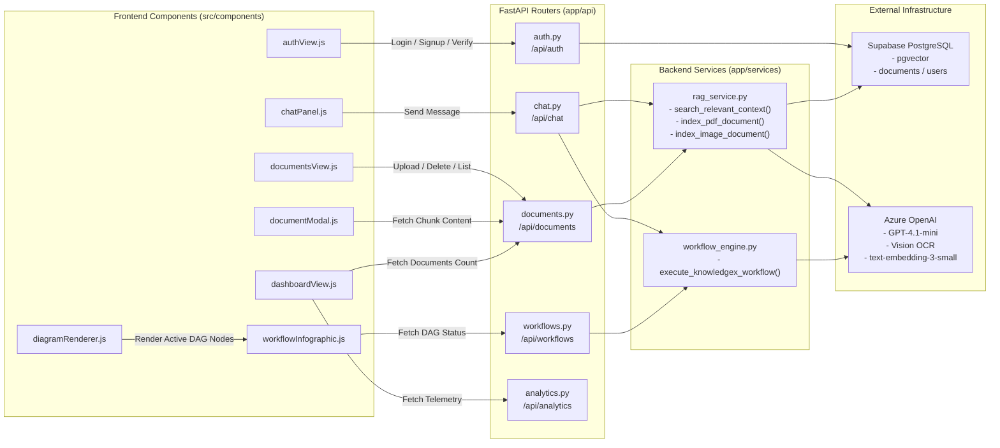
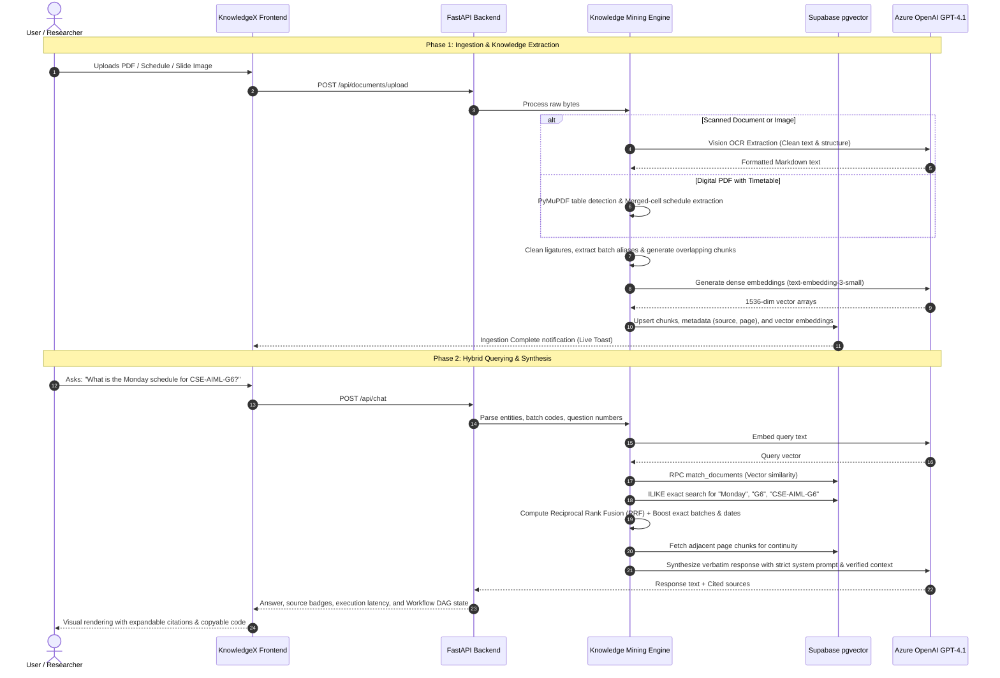

# KnowledgeX · Knowledge Mining & Executive Intelligence Platform 🧠⚡

[](https://fastapi.tiangolo.com)
[](https://vitejs.dev)
[](https://azure.microsoft.com/en-us/products/ai-services/openai-service)
[](https://supabase.com)
[](https://www.python.org/)
[](LICENSE)

**KnowledgeX** is an enterprise-grade **Knowledge Mining & Academic/Executive Intelligence System**. Built with an advanced multi-stage Retrieval-Augmented Generation (RAG) architecture, KnowledgeX ingests complex, unstructured, and multimodal documents (PDFs, high-resolution scans, images, and academic timetables) and transforms them into structured, queryable knowledge graphs.

It leverages **Azure OpenAI (GPT-4.1-mini & Vision OCR)**, **Supabase `pgvector`**, and a hybrid search engine powered by **Reciprocal Rank Fusion (RRF)**, exact lexical matching, question boosting, and context continuity expansion to deliver instant, verbatim answers with verifiable citations.

---

## 📑 Table of Contents

- [Key Capabilities](#-key-capabilities)
- [System Architecture & Workflow Flowcharts](#-system-architecture--workflow-flowcharts)
  - [1. High-Level System Architecture Flowchart](#1-high-level-system-architecture-flowchart)
  - [2. Document Ingestion & Knowledge Mining Flowchart](#2-document-ingestion--knowledge-mining-flowchart)
  - [3. Query Execution & Hybrid Retrieval Flowchart](#3-query-execution--hybrid-retrieval-flowchart)
  - [4. Multi-Agent Workflow DAG Flowchart](#4-multi-agent-workflow-dag-flowchart)
  - [5. Component Interaction Flowchart](#5-component-interaction-flowchart)
  - [6. End-to-End Sequence Diagram](#6-end-to-end-sequence-diagram)
- [Reciprocal Rank Fusion (RRF) Scoring Model](#-reciprocal-rank-fusion-rrf-scoring-model)
- [Project Directory Layout](#-project-directory-layout)
- [Database Schema & Stored Procedures](#-database-schema--stored-procedures)
- [API Reference](#-api-reference)
- [Installation & Quickstart](#-installation--quickstart)
- [Enterprise Safety & Security](#-enterprise-safety--security)
- [License](#-license)

---

## 🌟 Key Capabilities

- **🔍 Multimodal Document Ingestion & Vision OCR:**  
  Seamlessly extracts text and tables from native PDFs via PyMuPDF. For scanned documents, handwritten certificates, or image uploads (`.png`, `.jpg`, `.jpeg`, `.webp`), the engine automatically switches to **Azure OpenAI Vision** to perform high-fidelity OCR with zero information loss.

- **📅 Heuristic Timetable & Matrix Extractor:**  
  Includes a specialized schedule mining engine capable of resolving merged cells, multi-period spans (e.g., `9:00 - 11:00`), batch/section codes (e.g., `CSE-AIML-G6`, `3D`), instructor names, and room locations into structured Markdown grids.

- **⚡ Hybrid Vector + Lexical Search with RRF:**  
  Combines 1536-dimensional dense vector embeddings (`text-embedding-3-small`) with exact entity, question code (`Ques. 14`), and batch keyword matching using **Reciprocal Rank Fusion (RRF)** and weighted boosting.

- **🔗 Context Continuity Expansion:**  
  Automatically identifies and binds adjacent document pages to the retrieval window to prevent truncated answers across chunk boundaries.

- **🤖 Interactive Multi-Agent Workflow DAG:**  
  Features an execution graph that traces every query through modular stages: `Trigger` &rarr; `Variable Setter` &rarr; `Manager Agent` &rarr; `Knowledge Retriever` &rarr; `Condition Router` &rarr; `Synthesizer` &rarr; `Output Dispatcher`.

- **🎨 Executive High-Performance Interface:**  
  Zero-framework overhead vanilla JavaScript and CSS client featuring a dynamic operations dashboard, real-time citation cards, live latency trackers, interactive workflow infographics, and an animated robotic visual mascot.

- **🛡️ Enterprise Guardrails & Dual-Layer Auth:**  
  Embedded safety filters block sensitive or harmful inquiries in real time. Authentication uses PBKDF2-HMAC-SHA256 salted hashing with automatic fallback persistence.

---

## 🏛️ System Architecture & Workflow Flowcharts

### 1. High-Level System Architecture Flowchart

This flowchart outlines the primary layers of KnowledgeX and how data circulates across the client interface, API gateway, core processing engines, external AI models, and database:



---

### 2. Document Ingestion & Knowledge Mining Flowchart

This flowchart details how files are received, inspected, routed through OCR or native parsing, structured via the timetable matrix extractor, chunked, and embedded into vector storage:



---

### 3. Query Execution & Hybrid Retrieval Flowchart

This flowchart illustrates the step-by-step logic when a user asks a question, from instantaneous safety evaluation to parallel search, RRF rank fusion, and factual synthesis:

```mermaid
flowchart TD
    classDef startNode fill:#10b981,stroke:#047857,stroke-width:2px,color:#fff
    classDef decision fill:#d97706,stroke:#b45309,stroke-width:2px,color:#fff
    classDef process fill:#1e293b,stroke:#3b82f6,stroke-width:2px,color:#fff
    classDef aiCall fill:#4c1d95,stroke:#8b5cf6,stroke-width:2px,color:#fff
    classDef blocked fill:#991b1b,stroke:#dc2626,stroke-width:2px,color:#fff

    UserQuery(["💬 User Submits Message<br/>POST /api/chat"]):::startNode

    %% 1. Guardrail
    UserQuery --> GuardrailCheck{"Guardrail Check:<br/>Inappropriate Content?<br/>(Explosives, Violence, NSFW)"}:::decision
    GuardrailCheck -->|Violation Detected| BlockResponse["Return Safe Rejection Response<br/>(Latency: 0.1s, Zero LLM Call)"]:::blocked

    %% 2. Conversational Greeting
    GuardrailCheck -->|Safe| GreetingCheck{"Is Pure Greeting?<br/>('hello', 'hi', 'good morning')"}:::decision
    GreetingCheck -->|Yes| GreetingResponse["Return Fast Welcoming Response<br/>(No vector search needed)"]:::process

    %% 3. Query Processing & Entity Extraction
    GreetingCheck -->|No: Domain Inquiry| EntityParser["Query Parsing & Token Analysis:<br/>1. Extract Day Names (Monday - Friday)<br/>2. Extract Question Numbers (Q.14, Ques 15)<br/>3. Extract Batch / Class Codes (3D, G6, AIML)<br/>4. Extract Significant Keyword Tokens"]:::process

    %% 4. Parallel Retrieval Branches
    EntityParser --> BranchSplit{Parallel Retrieval}:::decision

    %% Branch A: Semantic Vector
    BranchSplit -->|Branch A: Semantic| EmbedQuery["Azure OpenAI Embeddings<br/>Model: text-embedding-3-small"]:::aiCall
    EmbedQuery --> SupabaseVector["Supabase RPC 'match_documents'<br/>Top 24 Cosine Matches"]:::process

    %% Branch B: Exact Lexical
    BranchSplit -->|Branch B: Lexical| SupabaseLexical["Supabase ILIKE Queries:<br/>- Batch Patterns (Class: %G6%, Aliases: %G6%)<br/>- Question Patterns (Ques. 14, Q14)<br/>- Keyword Substring Matching"]:::process

    %% 5. RRF & Scoring Fusion
    SupabaseVector --> RRF_Engine["Reciprocal Rank Fusion (RRF) & Scoring:<br/>Base Score = (1 / (60 + Rank)) + (1.2 * Similarity)<br/>+ (0.35 * Keyword Hits)<br/>+ 3.0 (Exact Batch Match Boost)<br/>+ 2.0 (Exact Day Match Boost)<br/>+ 2.0 (Exact Question Match Boost)"]:::process
    SupabaseLexical --> RRF_Engine

    RRF_Engine --> FilterTopK["Select Top K Documents<br/>(Score Threshold > 0.30)"]:::process

    %% 6. Context Continuity Expansion
    FilterTopK --> ContextExp{"Is Top Document Multi-Page?<br/>(Check page P+1 in store)"}:::decision
    ContextExp -->|Adjacent Page Exists| FetchNextPage["Fetch Adjacent Page P+1<br/>Append for complete context"]:::process
    ContextExp -->|No / Already present| FormatContext["Construct Markdown Context Blocks<br/>Include [Document: Source | Page X] tags"]:::process
    FetchNextPage --> FormatContext

    %% 7. LLM Verbatim Synthesis
    FormatContext --> AzureGPT["Azure OpenAI GPT-4.1-mini Synthesis<br/>Strict System Instructions:<br/>- Answer strictly from provided context<br/>- Preserve schedule slots, rooms, and marks<br/>- No external hallucinations"]:::aiCall

    AzureGPT --> BuildResponse["Package ChatResponse:<br/>- Answer Markdown<br/>- Source Badges with Similarity %<br/>- Execution Latency (e.g. 1.8s)<br/>- Workflow DAG Execution State"]:::process

    BuildResponse --> ReturnClient(["🚀 Render on Frontend Client<br/>(Formatted Markdown + Interactive Citations)"]):::startNode
```



---

### 4. Multi-Agent Workflow DAG Flowchart

Every query execution is orchestrated by an observable Directed Acyclic Graph (DAG) state machine:

```mermaid
graph TD
    classDef trigger fill:#064e3b,stroke:#10b981,stroke-width:2px,color:#fff
    classDef variable fill:#312e81,stroke:#6366f1,stroke-width:2px,color:#fff
    classDef agent fill:#164e63,stroke:#06b6d4,stroke-width:2px,color:#fff
    classDef retriever fill:#134e4a,stroke:#14b8a6,stroke-width:2px,color:#fff
    classDef condition fill:#78350f,stroke:#f59e0b,stroke-width:2px,color:#fff
    classDef synth fill:#0c4a6e,stroke:#0ea5e9,stroke-width:2px,color:#fff
    classDef output fill:#701a75,stroke:#d946ef,stroke-width:2px,color:#fff

    Node1["🟢 Node 1: Start<br/><b>Type:</b> Trigger | <b>0.1s</b><br/><i>Captures query & user session</i>"]:::trigger
    Node2["🟣 Node 2: Set Variable<br/><b>Type:</b> Variable Setter | <b>0.2s</b><br/><i>Initializes normalized context</i>"]:::variable
    Node3["🔵 Node 3: KnowledgeX-Manager<br/><b>Type:</b> Agent | <b>1.4s</b><br/><i>Analyzes intent & entities</i>"]:::agent
    Node4["🟣 Node 4: Set Variable<br/><b>Type:</b> Variable Setter | <b>0.1s</b><br/><i>Prepares search payload</i>"]:::variable
    Node5["🩵 Node 5: KnowledgeX-Knowledge<br/><b>Type:</b> Retriever | <b>2.8s</b><br/><i>Executes Hybrid RRF Search</i>"]:::retriever
    Node6{"🟡 Node 6: If / Else Condition<br/><b>Type:</b> Router | <b>0.3s</b><br/><i>Checks if verified context exists</i>"}:::condition
    Node7["🔷 Node 7: KnowledgeX-FinalAnswer<br/><b>Branch:</b> FACTUAL | <b>7.2s</b><br/><i>Synthesizes verbatim answer via GPT-4.1</i>"]:::synth
    Node8["💖 Node 8: Send Message<br/><b>Branch:</b> GENERAL | <b>0.0s</b><br/><i>Standard conversational response</i>"]:::output

    Node1 --> Node2
    Node2 --> Node3
    Node3 --> Node4
    Node4 --> Node5
    Node5 --> Node6
    Node6 -->|Context Found (FACTUAL)| Node7
    Node6 -->|No Context (GENERAL)| Node8

    Node7 --> Finish(["🏁 Response Delivered to UI Client"]):::trigger
    Node8 --> Finish
```

---

### 5. Component Interaction Flowchart

How client UI components map to backend FastAPI routes, application services, and external providers:



---

### 6. End-to-End Sequence Diagram



---

## 📁 Project Directory Layout

```
knowledgeX/
├── backend/
│   ├── app/
│   │   ├── api/
│   │   │   ├── analytics.py        # Telemetry, tokens, and usage metrics
│   │   │   ├── auth.py             # User signup, login, session tokens, PBKDF2 hashing
│   │   │   ├── chat.py             # Chat endpoint with guardrails & workflow execution
│   │   │   ├── documents.py        # PDF & Image upload, preview, and purge endpoints
│   │   │   └── workflows.py        # Workflow graph definitions and node statuses
│   │   ├── core/
│   │   │   ├── clients.py          # Azure OpenAI & Supabase client initializers
│   │   │   └── config.py           # Environment settings and Pydantic configuration
│   │   ├── services/
│   │   │   ├── rag_service.py      # Core Mining Engine: OCR, Timetables, RRF, Hybrid RAG
│   │   │   └── workflow_engine.py  # DAG execution engine and node tracking
│   │   └── main.py                 # FastAPI application root & CORS middleware
│   ├── .env.example                # Template for environment credentials
│   ├── requirements.txt            # Python dependencies (FastAPI, PyMuPDF, OpenAI, Supabase)
│   └── run.py                      # Uvicorn backend launcher script (Port 8000)
│
├── frontend/
│   ├── src/
│   │   ├── components/
│   │   │   ├── analyticsView.js        # Analytics telemetry charts & insights
│   │   │   ├── authView.js             # Authentication view (Sign In / Register)
│   │   │   ├── chatPanel.js            # Real-time chat stream, citations & latency card
│   │   │   ├── dashboardView.js        # Executive metric cards & repository summary
│   │   │   ├── diagramRenderer.js      # Dynamic workflow visualizer and SVG graph renderer
│   │   │   ├── documentModal.js        # Document content reader & chunk inspector modal
│   │   │   ├── documentsView.js        # Repository grid & drag-and-drop file uploader
│   │   │   ├── leftSidebar.js          # Navigation bar with dynamic active-view routes
│   │   │   ├── motionRobot.js          # Interactive 3D/animated visual mascot
│   │   │   ├── toast.js                # Animated notifications & confirmation modals
│   │   │   ├── topNav.js               # Header controls, current user profile, and status
│   │   │   ├── workflowInfographic.js  # Fullscreen interactive workflow DAG viewer
│   │   │   ├── workflowPanel.js        # Slide-out workflow execution timeline
│   │   │   └── workflowsView.js        # Workflows dashboard view
│   │   ├── styles/
│   │   │   ├── base.css                # Global tokens, typography, gradients & resets
│   │   │   ├── chat.css                # Chat UI styles, message bubbles & citation tags
│   │   │   ├── dashboard.css           # Metric widgets, graphs & card layouts
│   │   │   └── workflows.css           # Interactive DAG nodes, connectors & badges
│   │   └── main.js                     # Single Page Application entrypoint & state manager
│   ├── index.html                      # HTML shell & font definitions
│   ├── package.json                    # Frontend package dependencies & scripts
│   └── vite.config.js                  # Vite dev server and proxy setup
│
├── .gitignore                          # Ignores .env, node_modules, and cache files
└── README.md                           # Master project documentation
```

---

## 🗄️ Database Schema & Stored Procedures

KnowledgeX uses **PostgreSQL** with the **`pgvector`** extension in Supabase. Run the following SQL migration in your Supabase SQL Editor:

```sql
-- 1. Enable the pgvector extension
CREATE EXTENSION IF NOT EXISTS vector;

-- 2. Create the documents table for chunks and vector embeddings
CREATE TABLE IF NOT EXISTS documents (
    id BIGSERIAL PRIMARY KEY,
    content TEXT NOT NULL,
    metadata JSONB DEFAULT '{}'::jsonb,
    embedding VECTOR(1536),
    created_at TIMESTAMP WITH TIME ZONE DEFAULT NOW()
);

-- 3. Create an index for fast cosine distance vector searches
CREATE INDEX IF NOT EXISTS documents_embedding_cosine_idx 
ON documents 
USING ivfflat (embedding vector_cosine_ops)
WITH (lists = 100);

-- 4. Create an index for high-speed metadata source lookups
CREATE INDEX IF NOT EXISTS documents_metadata_source_idx 
ON documents ((metadata->>'source'));

-- 5. Stored Procedure for Cosine Similarity Search
CREATE OR REPLACE FUNCTION match_documents (
    query_embedding VECTOR(1536),
    match_count INT DEFAULT 10
) 
RETURNS TABLE (
    id BIGINT,
    content TEXT,
    metadata JSONB,
    similarity FLOAT
)
LANGUAGE plpgsql
AS $$
BEGIN
    RETURN QUERY
    SELECT
        d.id,
        d.content,
        d.metadata,
        1 - (d.embedding <=> query_embedding) AS similarity
    FROM documents d
    ORDER BY d.embedding <=> query_embedding
    LIMIT match_count;
END;
$$;

-- 6. Dedicated Users Table (Optional, automatically supported with fallback)
CREATE TABLE IF NOT EXISTS users (
    id UUID PRIMARY KEY DEFAULT gen_random_uuid(),
    email TEXT UNIQUE NOT NULL,
    name TEXT,
    password_hash TEXT NOT NULL,
    created_at TIMESTAMP WITH TIME ZONE DEFAULT NOW()
);
```

---

## 📡 API Reference

All backend endpoints are prefixed with `/api` and documented automatically at `http://127.0.0.1:8000/docs`.

### Authentication Endpoints
| Method | Endpoint | Description | Payload / Params |
| :--- | :--- | :--- | :--- |
| `POST` | `/api/auth/signup` | Registers a new account | `{ "email": "user@org.com", "password": "...", "name": "..." }` |
| `POST` | `/api/auth/login` | Authenticates user & issues session token | `{ "email": "user@org.com", "password": "..." }` |
| `GET` | `/api/auth/me` | Fetches current user session profile | Headers: `Authorization: Bearer <token>` |

### Chat & Mining Endpoints
| Method | Endpoint | Description | Payload / Params |
| :--- | :--- | :--- | :--- |
| `POST` | `/api/chat` | Queries the RAG system and executes workflow | `{ "conversation_id": "...", "message": "...", "history": [] }` |
| `GET` | `/api/documents` | Lists all indexed documents & chunk counts | None |
| `POST` | `/api/documents/upload` | Ingests and indexes a PDF or Image file | Form-data: `file: <binary>` |
| `GET` | `/api/documents/{name}/content`| Retrieves parsed chunks & text content for a document | Path parameter: `name` |
| `DELETE`| `/api/documents/{name}` | Deletes a single document and its vectors | Path parameter: `name` |
| `DELETE`| `/api/documents/purge` | Purges all indexed documents from vector store | None |

### Workflows & System Endpoints
| Method | Endpoint | Description | Payload / Params |
| :--- | :--- | :--- | :--- |
| `GET` | `/api/workflows` | Returns status of workflow nodes | None |
| `GET` | `/api/analytics` | Returns queries count, latency, and tokens | None |
| `GET` | `/health` | Healthcheck and connected engine status | None |

#### Example: Chat Query Request via cURL
```bash
curl -X POST "http://127.0.0.1:8000/api/chat" \
     -H "Content-Type: application/json" \
     -d '{
       "conversation_id": "session-101",
       "message": "What classes are scheduled on Wednesday for batch G6?",
       "history": []
     }'
```

---

## 🚀 Installation & Quickstart

### 1. Prerequisites
- **Python 3.10+**
- **Node.js 18+** & `npm`
- **Azure OpenAI Resource** with deployments for:
  - `gpt-4.1-mini` (or `gpt-4o-mini`)
  - `text-embedding-3-small`
- **Supabase Project** with `pgvector` enabled (see [Database Schema](#-database-schema--stored-procedures))

---

### 2. Backend Setup
1. Clone the repository and navigate to the `backend` directory:
   ```bash
   cd backend
   ```
2. Create and activate a Python virtual environment:
   ```bash
   # Windows (PowerShell)
   python -m venv venv
   .\venv\Scripts\Activate.ps1

   # Linux / macOS
   python3 -m venv venv
   source venv/bin/activate
   ```
3. Install required Python packages:
   ```bash
   pip install -r requirements.txt
   ```
4. Configure environment variables:
   ```bash
   cp .env.example .env
   ```
   Edit `.env` with your credentials:
   ```env
   # Supabase Configuration
   SUPABASE_URL=https://your-project.supabase.co
   SUPABASE_KEY=your-supabase-anon-key
   SUPABASE_SERVICE_ROLE_KEY=your-supabase-service-role-key

   # Azure OpenAI Configuration
   AZURE_ENDPOINT=https://your-resource.openai.azure.com/
   AZURE_API_KEY=your-azure-api-key
   AZURE_API_VERSION=2024-12-01-preview
   CHAT_MODEL=gpt-4.1-mini
   EMBED_MODEL=text-embedding-3-small
   ```
5. Launch the backend server:
   ```bash
   python run.py
   ```
   - Server runs at: `http://127.0.0.1:8000`
   - Interactive Swagger API documentation: `http://127.0.0.1:8000/docs`

---

### 3. Frontend Setup
1. In a separate terminal window, open the `frontend` directory:
   ```bash
   cd frontend
   ```
2. Install npm dependencies:
   ```bash
   npm install
   ```
3. Start the Vite development server:
   ```bash
   npm run dev
   ```
4. Access the web interface at **`http://localhost:5173`**.

---

## 🔒 Enterprise Safety & Security

- **Strict Inappropriate Content Guardrails:** An integrated regex-based safety layer intercepts requests involving hazardous substances, explosives, weapons, explicit sexuality, and violence at `0.1s` latency before contacting downstream LLMs.
- **Cryptographic Password Security:** User passwords are stored using salted `PBKDF2-HMAC-SHA256` iterations (`100,000` passes). Raw passwords never touch the database.
- **Credential Protection:** Secrets, API keys, and endpoint URLs are isolated in `.env` files and permanently excluded from version control via `.gitignore`.

---

